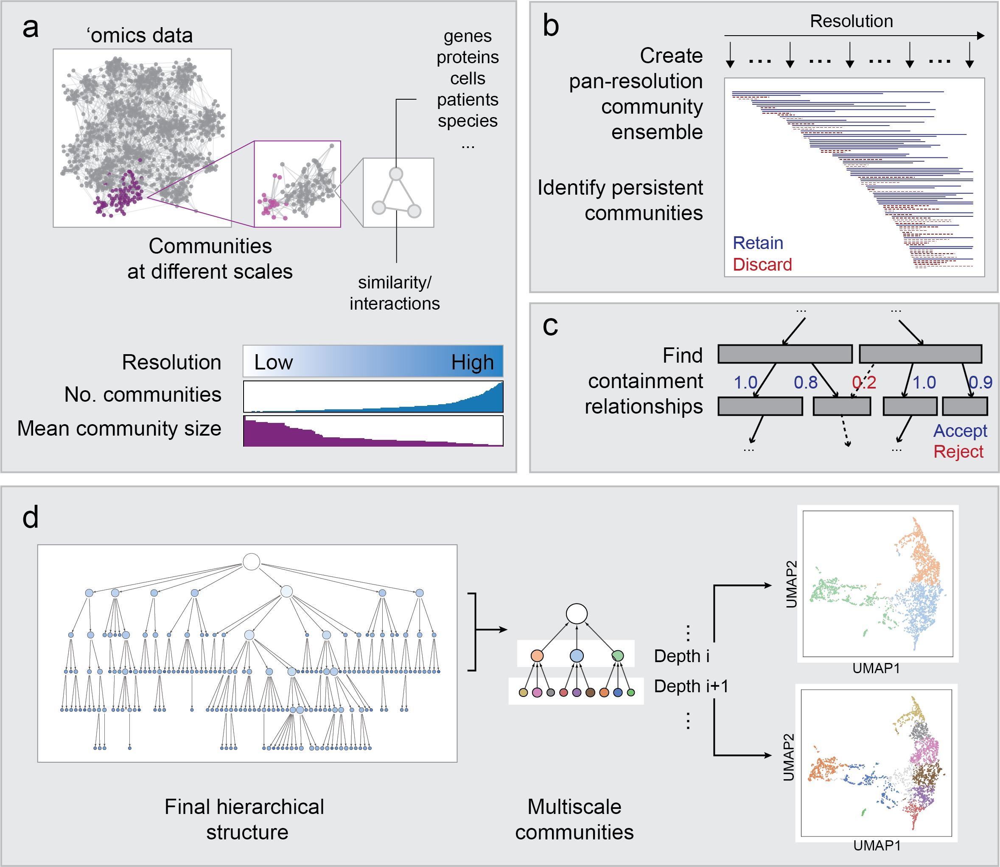

Generate persistent clusters
------------------------------------------------------

HiDeF ultilizes graph-based community detection (CD) with resolution parameters (such as Louvain [#f1]_ or Leiden [#f2]_ algorithms) to detect clusters. The resolution parameter was sampled at many values, and a set of communities was generated at each resolution. The solutions at each resolution were compared to each other. We define “persistent” communities as those repetitively discovered in many different resolutions.

As graph-based CD methods are in general heuristic, it is not common to find identical clusters repetitively. However, we can measure similarity between clusters. Imagining a graph in which each node represent a community and each edge connects two similar communities, a component in this graph a group of similar communities, and the size of these components can be seen as a metric of community persistence.

The following example takes the BioPlex [#f3]_ protein-protein interaction network, scans the resolution parameter from 0.001 to 25, and returns the communities with persistence larger than 5 (default parameters). Source files can be found in the ``examples`` directory.

.. code-block:: python

    python hidef_finder.py --g BioPlex.tsv  --o BioPlex [--options]

Output formats
^^^^^^^^^^^^^^

``*.nodes``: a .tsv file in which each row represents a community. The first 3 columns being the name, the size, and the elements of the community. See ``hidef_finder.output_nodes``.

``*.edges`` a .tsv file in which each row represents a directed edge. The first and second column indicate the target (parent) and source (child community, respectively. See ``hidef_finder.output_edges``.

``*.gml`` a file in the GML (Graph Modelling Language) format to represent the DAG. See ``hidef_finder.output_gml``.

``*.gmt`` GMT format as described in `GSEA <https://software.broadinstitute.org/cancer/software/gsea/wiki/index.php/Data_formats>`_. (Coming soon)

Use the feature matrix of data points as input
^^^^^^^^^^^^^^^^^^^^^^^^^^^^^^^^^^^^^^^^^^^^^^

The default input of HiDeF is a format representing a graph. Still, if the input data is in the format of feature vectors of data points, a k-nearest neighbor graph (kNN) or a shared k-nearest neighbor graph (sNN) can be generated by other methods, such as ``umap.umap_.nearest_neighbors`` or ``sklearn.neighbors.NearestNeighbors``. HiDeF function ``jaccard_matrix`` can help convert kNN to sNN:

.. code-block:: python

    from hidef import utils
    mat_knn = scipy.sparse.csr_matrix(mat_knn)
    indices = utils.jaccard_matrix(mat_knn, mat_knn, threshold=0.1)
    with open(outfile, 'w') as fh:
        for i in range(len(indices[0])):
            fh.write('{}\t{}\n'.format(indices[0][i], indices[1][i]))

.. Note::
   Building kNN or sNN graph followed by graph-based community detection is a common workflow of single-cell analysis in prominent software packages such as ``Seurat`` or ``Scanpy``. However, the resolution parameter needs to be specified in those packages. HiDeF scans resolution parameters and makes it easy to identify structures at more diverse scales.

.. [#f1] Blondel, V. D., Guillaume, J.-L., Lambiotte, R. & Lefebvre, E. Fast unfolding of communities in large networks. J. Stat. Mech. 2008, P10008 (2008)
.. [#f2] Traag, V. A., Waltman, L. & van Eck, N. J. From Louvain to Leiden: guaranteeing well-connected communities. Sci. Rep. 9, 5233 (2019)
.. [#f3] Huttlin, E. L. et al. Architecture of the human interactome defines protein communities and disease networks. Nature 545, 505–509 (2017)