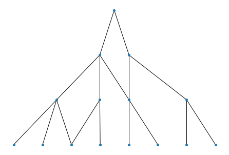
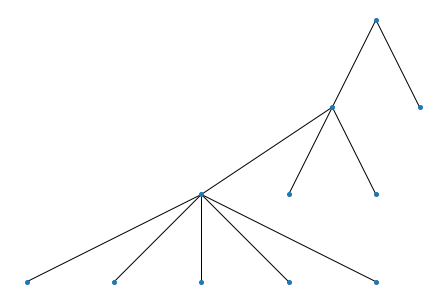
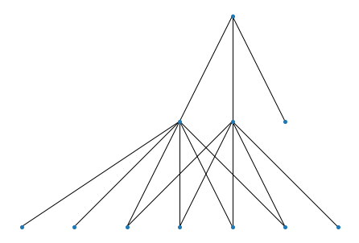
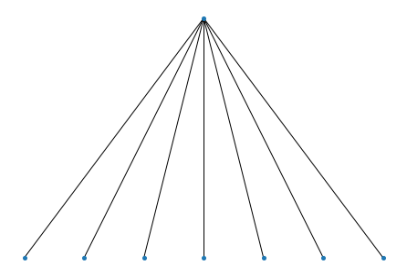

Organize a list of clusters into a DAG
---------------------------------------

HiDeF is flexible and the construction of DAG is independent of the upstream clustering algorithm. The ``weaver`` module can take an arbitrary list of clusters and infer the relationships among them. We defined containment index

.. math:: CI(v,w) = \frac{|s(v) \cap s(w)|}{|s(w)|}

as the fraction of data points in cluster *w* that is also in cluster *v*. In the following example, all data points of cluster at line 2 is also members of the cluster at line 1, so we use a directed edge to represent this relationship.

.. code-block:: python

    from hidef import *
    wv = weaver.Weaver()

    P = ['11111111',
         '11111100',
         '00001111',
         '11100000',
         '00110000',
         '00001100',
         '00000011']
    wv = weaver.Weaver()
    H = wv.weave(P, cutoff=1.0)

    wv.show() # need pydot and graphviz

.. Note::
    The last command ``wv.show`` is a convenient function to quickly browse the model, but needs additional dependencies `pydot <https://github.com/pydot/pydot>`_ and `graphviz <https://graphviz.org/>`_. See more discussion here: :ref:`render`.

In many cases, it could be informative to relax the requirement of :math:`CI = 1` to reveal the relationships between clusters. Thus we provide a parameter :math:`\tau` ("cutoff" in the above code block) to approximate the containment relationships, as can be seen in the following example.

.. code-block:: python

    P = ['11111111',
         '11111100',
         '00111110'] # cluster 3 almost contained in cluster 2
    H = wv.weave(P, cutoff=0.75) # containment threshold relaxed here
    wv.show()

.. code-block:: python

    P = ['11111111',
         '11111100',
         '00111110'] # cluster 3 almost contained in cluster 2
    H = wv.weave(P, cutoff=1.0) # strict containment
    wv.show()

.. Note::
    Since we do not restrict the input, it is possible to have mutually contained (even identical) clusters. In such cases, we decide the two (or more) mutually contained clusters as “similar”, and there is an option to merge them.

.. code-block:: python

    P = ['11111110',
         '11111110']
    H = wv.weave(P, merge=True)
    wv.show()

.. code-block:: python

    P = ['11111110',
         '11111110']
    H = wv.weave(P, merge=False) # without merge, the DAG contains duplicated cluster
    wv.show()

.. image:: ../img/organize_5.png
  :width: 300

Although an arbitrarily defined set of clusters can be used, a routine workflow is to use network community detection to generate a set of clusters (see the next topic).